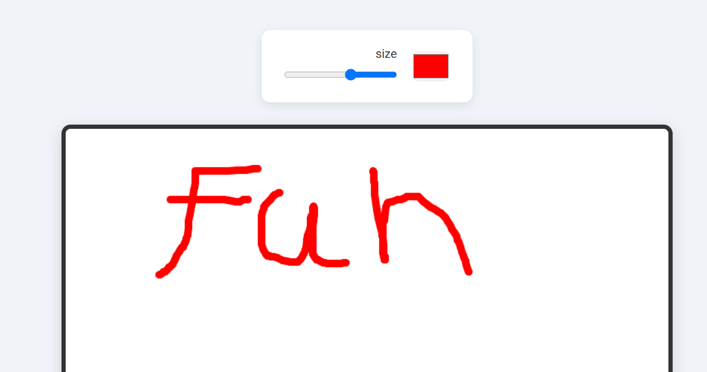

# 🎨 HTML5 Canvas Drawing App

A simple drawing application using HTML5 `<canvas>` element and vanilla JavaScript.  
Users can draw freely with adjustable brush **color** and **size**.

## 🚀 Features

- Freehand drawing on canvas
- Change brush color using color picker
- Adjust brush thickness with range slider
- Responsive and beginner-friendly codebase

## 📂 Project Structure

```
project-root/
├── index.html
├── assets/
│   ├── css/
│   │   └── style.css
│   └── script/
│       └── main.js
```

## 🛠️ Technologies

- HTML5
- CSS3
- JavaScript (Vanilla)

## 🎮 How to Use

1. Clone the repository:
   ```bash
   git clone https://github.com/your-username/your-repo-name.git
   ```
2. Open `index.html` in your browser.
3. Pick a color and brush size, then start drawing on the canvas!

## 📸 Preview



## 📃 License

This project is open source and available under the [MIT License](LICENSE).

---

Made with ❤️ using pure JavaScript.